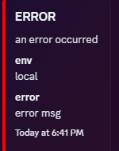
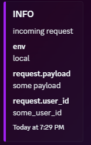
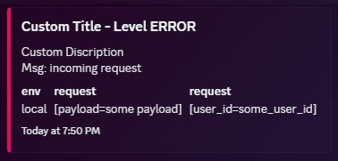

# slog-discord
A [slog](https://pkg.go.dev/log/slog) handler that sends logs to Discord through its [webhook API](https://discord.com/developers/docs/resources/webhook).

## Install
```sh
go get github.com/betrayy/slog-discord
```

## Usage

### Notes
- All slog attributes and groups will be included in Discord logs :)
- Keep in mind that, by default, logs are sent to Discord asynchronously. So they may be sent out of order.
  - If the program exits too early, the logs will not be sent. Set sync mode to fix this.
- Uses [disgo](https://github.com/disgoorg/disgo/tree/master) under the hood to send Discord API requests and build Discord embeds.
  - This also means that rate limiting is built-in.
- You can configure to use a second slog handler alongside the Discord handler. That way, you are not just limited to Discord.
  - You may consider using a multi-handler flow (separately) if you need to use multiple handlers.


### Requirements
First, create a Discord webhook URL ([guide](https://support.discord.com/hc/en-us/articles/228383668-Intro-to-Webhooks))

### Configuration

Here are the fields that you can configure yourself.
```go
type DiscordHandler struct {
	Handler    slog.Handler       // Underlying slog handler that gets called in every slog.Handler method (default: noop handler that does nothing)
	WebhookURL string             // Discord webhook URL (required)
	MinLevel   slog.Level         // minimum slog level for Discord logs (default: slog.LevelDebug)
	SyncMode   bool               // If true, then send logs to Discord synchronously. Otherwise, asynchronously (default: false)
	Timeout    time.Duration      // API request timeout (default: 10s)
	ColorMap   ColorMap           // The color mappings for slog.Level for Discord embeds (default: DefaultColorMappings)
	BuildEmbed BuildEmbed         // The function to build the discord.Embed before logging to Discord (default: DiscordHandler.defaultBuildEmbed)
}
```

### Examples
You can find some examples [here](./example).
#### Basic
```go
package main

import (
	"github.com/betrayy/slog-discord"
	"log/slog"
	"os"
)

func main() {
	webhookURL := "webhook_url"

	opts := []slogdiscord.Option{
		slogdiscord.WithMinLevel(slog.LevelWarn), // only log to Discord if slog level is warning or higher
		slogdiscord.WithSyncMode(true), // send logs to discord synchronously
		// also log to console, but it can be any slog handler
		// this handler gets called after discord handler
		slogdiscord.WithHandler(slog.NewJSONHandler(os.Stdout, &slog.HandlerOptions{Level: slog.LevelWarn})),
	}

	// instantiate the discord handler
	// typically, an error is returned if the webhook url is invalid
	discordHandler, err := slogdiscord.NewDiscordHandler(webhookURL, opts...)
	if err != nil {
		panic(err)
	}

	// instantiate the slog logger
	logger := slog.New(discordHandler)

	// start logging!
	logger = logger.With("env", "local")
	logger.Error("an error occurred", "error", "error msg") // logged to discord and console
}

```


#### Advanced
**Custom color maps:**
```go
package main

import (
	"github.com/betrayy/slog-discord"
	"log/slog"
)

func main() {
	webhookURL := "webhook_url"

	// for undefined mappings, the color will be set to 0x0 (black)
	colorMap := slogdiscord.ColorMap{
		slog.LevelInfo: 0xA020F0, // purple
	}

	opts := []slogdiscord.Option{
		slogdiscord.WithSyncMode(true),
		slogdiscord.WithColorMap(colorMap),
	}

	discordHandler, err := slogdiscord.NewDiscordHandler(webhookURL, opts...)
	if err != nil {
		panic(err)
	}

	logger := slog.New(discordHandler)

	logger = logger.With("env", "local")
	logger = logger.WithGroup("request")
	logger.Info("incoming request",
		slog.String("payload", "some payload"),
		slog.String("user_id", "some_user_id"),
	)
}
```


**Custom embed builder:**
> Note: the Discord handler passes all attributes to the builder function, not just
> the record's attributes.
> 
> Additionally, you will need to import [disgo](https://github.com/disgoorg/disgo/tree/master) in order to work with embeds.
```go
package main

import (
	"github.com/betrayy/slog-discord"
	"github.com/disgoorg/disgo/discord"
	"log/slog"
)

func main() {
	webhookURL := "webhook_url"
	
	// define your custom embed builder function (ensure it matches the signatures of slogdiscord.BuildEmbed)
	customBuilder := func(record slog.Record, attrs []slog.Attr, builder *discord.EmbedBuilder) discord.Embed {
		builder.SetTitlef("Custom Title - Level %s", record.Level)
		builder.SetDescriptionf("Custom Discription\nMsg: %s", record.Message)
		builder.SetTimestamp(record.Time)
		if record.Level == slog.LevelError {
			builder.SetColor(0xE30B5C) // overrides the color set by the configured color map
		}
		for _, attr := range attrs {
			builder.AddField(attr.Key, attr.Value.String(), true)
		}
		return builder.Build()
	}

	opts := []slogdiscord.Option{
		slogdiscord.WithSyncMode(true),
		slogdiscord.WithEmbedBuilder(customBuilder),
	}

	discordHandler, err := slogdiscord.NewDiscordHandler(webhookURL, opts...)
	if err != nil {
		panic(err)
	}

	logger := slog.New(discordHandler)

	logger = logger.With("env", "local")
	logger = logger.WithGroup("request")
	logger.Error("incoming request",
		slog.String("payload", "some payload"),
		slog.String("user_id", "some_user_id"),
	)
}
```


## Contributing
If you would like to contribute, whether it is a suggestion or bug fix, please fork the repo and create a pull request. Any contributions would be appreciated :)
1. Fork the project
2. Create your feature branch - `git checkout -b feature/YourFeature`
3. Commit your changes - `git commit -m 'Add this YourFeature'`
4. Push to the branch - `git push origin feature/YourFeature`
5. Open a pull request

### Feature Requests / Need Help?
If you would like to request a new feature or need help, then feel free to open a new issue.

## Built With
* [disgo](https://github.com/disgoorg/disgo/tree/master/webhook) - a Go wrapper for the Discord API
* [slog-common](https://github.com/samber/slog-common) - common slog utilities

### Credits
- [slog-slack](https://github.com/samber/slog-slack/tree/main) - for the logic to merge slog groups and attributes (both logger and record scopes)

## License
This project is licensed under the MIT License - see the [LICENSE.md](LICENSE) file for details.
